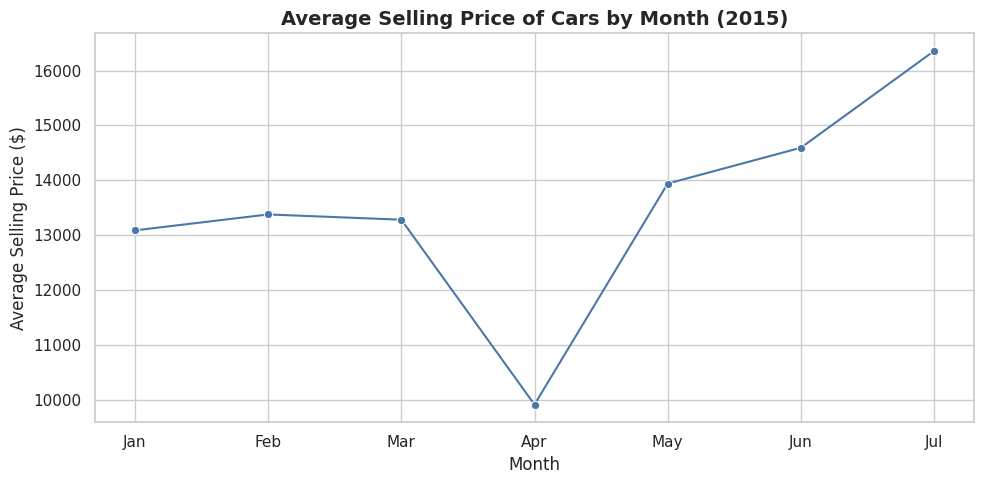
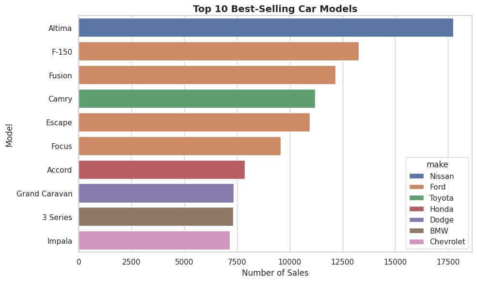
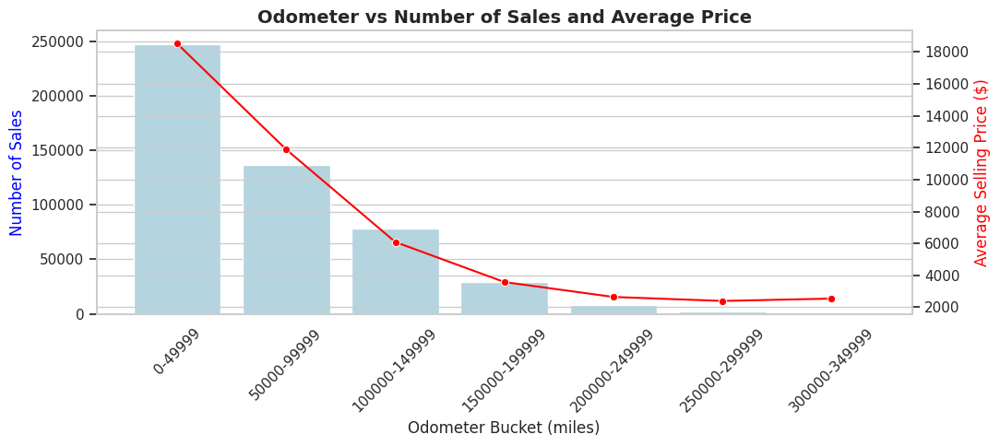
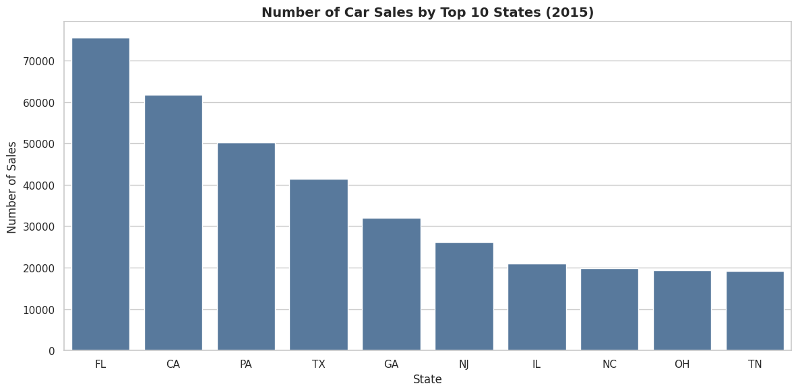
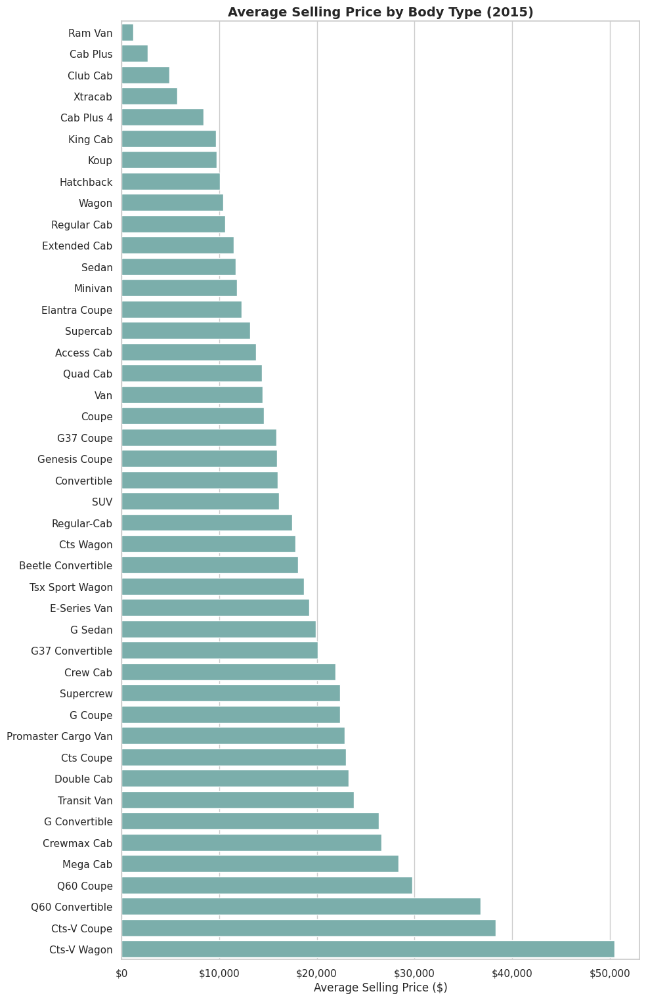

# 🧠 Car Sales Analysis  
*A data-driven exploration of the U.S. used-car market to identify pricing and sales trends using SQL and Python.*

## 🔹 1. Project Overview
The used car market is shaped by seasonal demand, vehicle condition, mileage, and regional factors.  
This project analyzes U.S. car sales data (from Kaggle) using **SQL** for data preparation and **Python** (pandas + seaborn + matplotlib) for visualization.  

**Goal:** Identify pricing trends, sales distributions, and key market insights for used cars between **2015–2020**.

---

## 🔹 2. Business Questions
- How do average car prices change month-to-month?  
- Which car makes and models sell the most?  
- How does mileage (odometer) impact pricing and sales volume?  
- Which U.S. states record the most sales?  
- How do average prices vary by body type?

---

## 🔹 3. Methodology
**Dataset:** [Vehicle Sales Data (Kaggle)](https://www.kaggle.com/datasets/syedanwarafridi/vehicle-sales-data)  
**Tools Used:**
- **SQL** – filtering, aggregation, and cleaning  
- **Python (pandas, seaborn, matplotlib)** – visualization and exploratory analysis  

**Steps Taken:**
1. Cleaned and filtered the dataset to include **2015–2020** data.  
2. Created summary tables through SQL queries.  
3. Built polished visualizations to interpret trends clearly.  

---

## 🔹 4. Results & Visualizations  

### 📈 Average Selling Price by Month (2015)
**Insight:**  
Prices vary throughout the year, showing early-year and mid-summer peaks that align with stronger buyer demand. The dataset contained records primarily from 2015, reflecting that year's pricing trend.

---

### 🚘 Top 10 Best-Selling Car Models  
**Insight:**  
The most popular models, primarily Toyota and Honda sedans, dominated sales. This suggests reliability and affordability are key factors driving repeat purchases.

---

### ⏱️ Odometer vs. Number of Sales and Average Price  
**Insight:**  
Lower-mileage vehicles sold for higher prices but in smaller volumes. As mileage increased, prices dropped while sales volumes rose — reflecting affordability as a driver of higher turnover.

---

### 🗺️ Number of Car Sales by State (2015)  
**Insight:**  
States like California, Texas, and Florida recorded the most sales. Urban and high-population regions maintain stronger used car markets and faster vehicle turnover.

---

### 🚗 Average Selling Price by Body Type  
**Insight:**  
SUVs and pickups command higher resale prices compared to sedans and hatchbacks. All categories were standardized for consistent naming, improving readability and analysis.

---

## 🔹 5. Key Takeaways  
- **Seasonality:** Pricing shows cyclical patterns influenced by buyer timing.  
- **Mileage Impact:** Higher mileage consistently lowers price but drives more frequent transactions.  
- **Regional Variation:** High-population states dominate overall sales.  
- **Body Type:** SUVs and trucks sustain premium resale values across markets.

---

## 🔹 6. Next Steps  
- Extend analysis with **predictive modeling** (e.g., regression of price vs. mileage, body type, and state).  
- Integrate **economic indicators** (fuel cost, regional income) for richer context.  
- Build an **interactive dashboard** using Tableau or Streamlit for exploration.

---

### 📁 Folder Structure
